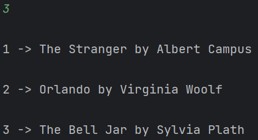

# SOLID Principles


## Author: Afteni Maria

----

## Objectives:
&ensp; &ensp;
__1. Study and understand the SOLID Principles.__

&ensp; &ensp; 
__2. Choose a domain, define its main classes/models/entities and choose the appropriate instantiation mechanisms.__

&ensp; &ensp;
__3. Create a sample project that respects SOLID Principles.__


## Theory:
The SOLID principles are a set of five fundamental principles in object-oriented design that guide software engineers in 
creating maintainable and scalable software:

* __Single Responsibility Principle (SRP)__: Each class or module should have a single, well-defined responsibility. 
This principle encourages separation of concerns, making code easier to understand and modify.

* __Open-Closed Principle (OCP)__: Software entities (e.g., classes, modules) should be open for extension but closed for 
modification. This means you can add new functionality through inheritance or interfaces without altering existing code.

* __Liskov Substitution Principle (LSP)__: Subtypes or derived classes should be substitutable for their base types without 
affecting the correctness of the program. This principle ensures that derived classes adhere to the contracts established 
by their base classes.

* __Interface Segregation Principle (ISP)__: Clients should not be forced to depend on interfaces they do not use. 
It advocates creating small, specific interfaces rather than large, monolithic ones, thus preventing classes from 
implementing unnecessary methods.

* __Dependency Inversion Principle (DIP)__: High-level modules should not depend on low-level modules; both should depend 
on abstractions. This principle promotes the use of interfaces or abstract classes to decouple components, facilitating 
flexibility and easier testing.


## Implementation
In this laboratory work I implemented a simulation of a library archive. In the `Model` package, are described all the 
models that are used such as: `Client`, `Book`. This distribution of the classes permits the implementation of the first SOLID 
Principle, which is the Single Responsibility principle. This way, each model class describes the functionality of a single
structure. Let's look at the Client class. The functionality of this class is to set the Credentials of a client in the hash Map.

```
public class Client {
    String Username;

    public String Set_User_Username(){
        Scanner scanner = new Scanner(System.in);
        System.out.println("Username:");
        Username = scanner.nextLine();
        return Username;
    }

    public String Set_User_Password(){
        Scanner scanner = new Scanner(System.in);
        System.out.println("Password:");

        return scanner.nextLine();
    }
}
```
To implement the Open-closed Principle, I created an abstract class. The abstract class `Book` is extended by two classes.
Now, in order to make changes to the child classes, the abstract class should be extended.

```
abstract class Book {

    abstract Map<String, String> Add_Book(Map<String, String> Books);
    abstract boolean Book_exists(Map<String, String> Books);
}

```

Using the class, that is presented above, I implemented the Liskov Substitution Principle. All the methods described in 
the `Book`, are implemented in the classes that extend it. So, in case of necessity, the classes `EBook` and `Physical_Book`
can substitute the `Book` class and the functionality will remain the same.

In the simulation, I didn't include any interfaces, as they aren't necessary at this stage. Therefore, the client isn't 
forced to depend on the interfaces that he doesn't need and the Interface Segregation Principle is respected.

To respect the Dependency Inversion principle, I implemented the abstract class `Book`. This way low-level modules depend 
on an abstraction.


## Conclusions / Screenshots / Results
In conclusion, this laboratory work has been a highly educational and practical experience. Throughout this project, I
not only dived into the core principles of object-oriented design but also witnessed their tangible impact on software development.

The SOLID principles provided me with a structured framework to design and refactor the codebase, ensuring that othe
project remained maintainable and extensible. 





